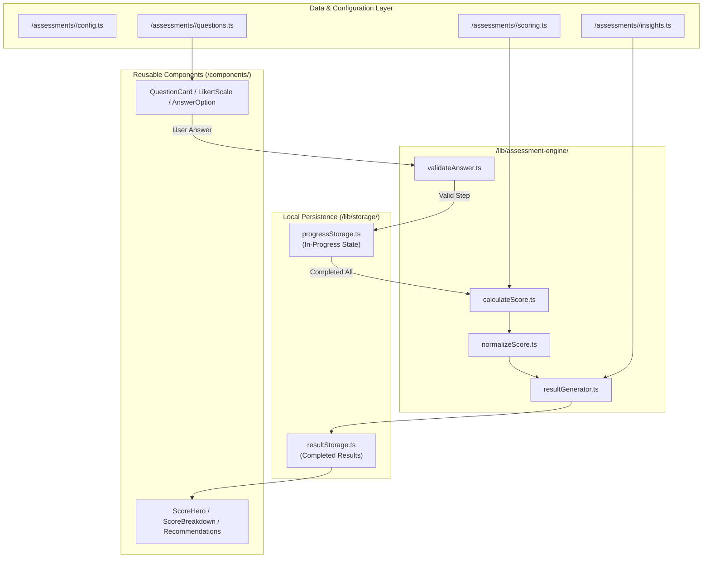

# Rule 1: Architecture & System Design

> **Objective:** Create and maintain a production-quality architecture for a mobile-first assessment PWA. The architecture must remain simple enough for a solo developer to maintain.

---

## Core Principles

1. **Build ONE application containing all assessments.**
   The entire platform operates as a unified Progressive Web Application hosting the entire catalog of assessments under a shared shell and design system.
2. **Never create separate implementations of the assessment engine.**
   All assessment calculations, state transitions, validation, and score evaluations must flow through a single, unified assessment engine.
3. **Assessments must be configuration/data-driven.**
   Every assessment is defined as structured data (configurations, questions, metadata, thresholds, insights) rather than hardcoded program logic.
4. **Questions, scoring rules, result levels, insights and recommendations must be separated from UI components.**
   Domain data, calculation formulas, and content strings must never be mixed with React JSX or presentation logic.
5. **UI components must be reusable.**
   UI elements (cards, option selectors, sliders, scales, progress bars, result heroes) must be generic and assessment-agnostic.
6. **Keep business logic outside React presentation components.**
   React components only receive props, fire user interaction callbacks, and render states. Calculations and storage interactions belong in dedicated modules and hooks.
7. **Keep assessment-specific logic inside `/assessments/<assessment-id>/`.**
   Isolated assessment definitions (questions, scoring weights, outcome tiers, and personalized recommendations) reside strictly in their respective assessment directory.
8. **Keep shared calculation logic inside `/lib/assessment-engine/`.**
   Generic scoring utilities, percentile mappings, normalization formulas, and result compilation functions belong in the shared core engine.
9. **Use TypeScript strict mode.**
   All code must be strictly typed with explicit interfaces for assessments, questions, options, user responses, scores, and result tiers. No `any` types.
10. **Avoid unnecessary dependencies.**
    Rely on modern web platform capabilities, standard React features, and native browser APIs. Do not add libraries for trivial tasks.
11. **Do not introduce Redux unless a real requirement appears.**
    Use React's built-in state primitives (`useState`, `useReducer`, React Context) combined with local storage persistence. Avoid complex state management libraries.
12. **No authentication or backend is required for the initial version.**
    The client operates completely serverless and offline-capable. Users can access, start, take, and review assessments without sign-up or server sessions.
13. **Persist assessment progress and completed results locally.**
    Store in-progress answer states and historical results in `localStorage` or `IndexedDB` so sessions are never lost accidentally.
14. **Never store unnecessary personal information.**
    Adhere to strict data minimization. Never ask for or store identifiable personal data (names, emails, phone numbers) unless explicitly required and consented to.
15. **Assessment results must remain available after page refresh.**
    Results must be retrievable from local storage via persistent result IDs or slug parameters even upon hard refresh or browser reopening.
16. **Use URL routes that are shareable and SEO-friendly.**
    Maintain clean, semantic routes (e.g. `/assessment/[slug]`, `/assessment/[slug]/start`, `/assessment/[slug]/questions`, `/assessment/[slug]/result`).
17. **Use dynamic imports/code splitting when beneficial.**
    Lazy load assessment data and heavy result visualizations on-demand so non-visited assessments do not inflate the initial bundle.
18. **Keep initial JavaScript and asset payloads as small as reasonably possible.**
    Optimize critical rendering path, inline critical styles, minify SVG icons, and keep the main entry bundle lean for fast mobile network performance.
19. **Do not duplicate components merely because assessments have different questions.**
    Support different question variants (multiple-choice, Likert scale, scenario, slider) via polymorphism inside standard question components rather than duplicated pages.
20. **New assessments should be addable by creating configuration/question/scoring files rather than modifying the core engine.**
    The platform should scale seamlessly: onboarding assessment #2 or #15 requires only declaring its dataset and registering its slug.

---

## Architecture Breakdown

### 1. Directory Responsibility Model

```
assessment-pwa/
├── app/                          # Next.js App Router (Routing, Layouts, Pages)
│   ├── assessment/[slug]/        # Dynamic route driving all assessment flows
│   │   ├── page.tsx              # Landing & overview for [slug]
│   │   ├── start/page.tsx        # Instructions & pre-test check
│   │   ├── questions/page.tsx    # Question runner
│   │   └── result/page.tsx       # Assessment-specific result report
│   ├── results/                  # User's local assessment history overview
│   └── ...                       # Explore, About, Legal
│
├── assessments/                  # Assessment Content & Specific Logic
│   └── <assessment-id>/          # e.g., iq, personality, stress, sleep...
│       ├── config.ts             # Metadata, timing, category, route slug
│       ├── questions.ts          # Strongly typed question catalog & options
│       ├── scoring.ts            # Scoring algorithm & raw-to-normalized transforms
│       └── insights.ts           # Tier descriptions, strengths & recommendations
│
├── components/                   # Agnostic Presentation Layer
│   ├── ui/                       # Base primitives (Button, Card, Modal, ProgressBar)
│   ├── assessment/               # Standardized question & runner components
│   ├── results/                  # Reusable score displays, breakdown & insight cards
│   └── navigation/               # Header, BottomNav
│
├── lib/                          # Core Business Logic & Infrastructure
│   ├── assessment-engine/        # Generic scoring, validation & result generation
│   ├── storage/                  # Local persistence (progressStorage, resultStorage)
│   ├── sharing/                  # Web Share API & social share utilities
│   └── analytics/                # Privacy-respecting event dispatchers
│
└── types/                        # Global TypeScript Interfaces
    ├── assessment.ts             # AssessmentConfig, AssessmentCategory
    ├── question.ts               # Question, AnswerOption, QuestionType
    └── result.ts                 # ScoreResult, ScoreBreakdown, InsightItem
```

---

### 2. Assessment Engine & Data Flow



---

### 3. Separation of Concerns Matrix

| Layer | Allowed Responsibilities | Forbidden Patterns |
|---|---|---|
| **`app/assessment/[slug]`** | Route handling, passing URL slug params, metadata definitions, assembling page layouts | Direct scoring math, hardcoded question text, inline calculation formulas |
| **`assessments/<id>/`** | Question texts, scoring weights, category-specific rubrics, tailored insights | React JSX components, DOM manipulation, storage manipulation |
| **`lib/assessment-engine/`** | Pure calculation functions, answer validators, score normalization, result builder | UI imports, CSS styling, assessment-specific hardcoding |
| **`components/`** | Rendering UI, triggering user callback events, styling, animations | Direct local storage calls, calculation algorithms, hardcoded assessment copy |
| **`lib/storage/`** | `localStorage` / `IndexedDB` serialization, retrieval, hydration, schema versioning | UI presentation, business validation logic |

---

### 4. Solo-Developer Maintainability Guidelines

1. **Zero Boilerplate Overhead**: Avoid microservices, unnecessary state wrappers, or third-party orchestration tools. Code should be readable in standard TypeScript within seconds.
2. **Predictable Scalability**: Adding a new assessment (e.g. `spending-habits`) must only require populating files in `assessments/spending-habits/` and registering the slug in the central index.
3. **Fail-Safe Client Defaults**: If storage is corrupted or an answer option is missing, the engine gracefully falls back without crashing the PWA.
4. **Deterministic & Testable**: All engine calculations in `lib/assessment-engine/` must be pure functions with predictable inputs and outputs, enabling instant unit testing.
